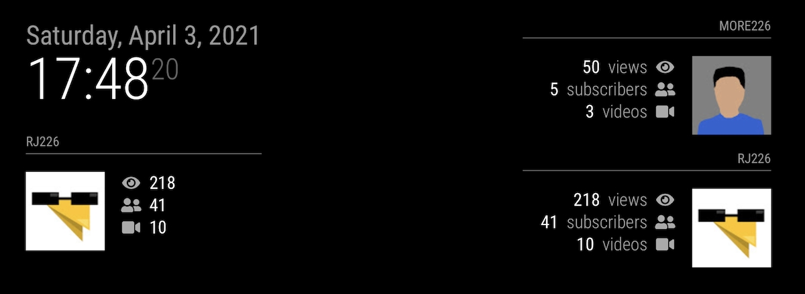

# MagicMirror Module: MMM-YouTubeChannelStats

A MagicMirror Module for displaying statistics about YouTube channels.

[](https://MagicMirror.builders)
[](https://raw.githubusercontent.com/ianperrin/MMM-YouTubeChannelStats/master/LICENSE)

[](https://codeclimate.com/github/ianperrin/MMM-YouTubeChannelStats)
[](https://snyk.io/test/github/ianperrin/MMM-YouTubeChannelStats)

## Example



## Installation

1. Stop your MagicMirror and clone the repository into the modules folder

   ```bash
   cd ~/MagicMirror/modules
   git clone https://github.com/ianperrin/MMM-YouTubeChannelStats.git
   cd ~/MagicMirror/modules/MMM-YouTubeChannelStats
   ```

2. Create a Google API key

   - For more information see the Google documentation for [obtaining a developer key](https://developers.google.com/youtube/v3/getting-started)
   - Make a note of the `API key`

3. Add the module to the config file (`~/MagicMirror/config/config.js`) for your mirror.

   ```javascript
   modules: [
     {
       module: "MMM-YouTubeChannelStats",
       position: "top_right",
       config: {
         channelIds: "your_youtube_channel_id,another_youtube_channel_id",
         apiKey: "your_google_api_key"
       }
     }
   ];
   ```

   The full list of config options can be found in the [configuration options](#configuration-options) table.

4. Restart the MagicMirror

   ```bash
   pm2 restart mm
   ```

## Updating the module

To update the module to the latest version,

1. Pull the changes from this repository into the module folder:

   ```bash
   cd ~/MagicMirror/modules/MMM-YouTubeChannelStats
   git pull
   ```

2. Restart the mirror

   ```bash
   pm2 restart mm
   ```

## Configuration options

The following properties can be added to the configuration:

| **Option**         | **Default**                          | **Description**                                                                                                                                                                                                                                                           | **Possible Values**                                   |
| ------------------ | ------------------------------------ | ------------------------------------------------------------------------------------------------------------------------------------------------------------------------------------------------------------------------------------------------------------------------- | ----------------------------------------------------- |
| `channelIds`       |                                      | The YouTube channel id or ids. _Note:_ Multiple channel ids can be entered as a comma separated list (e.g. `"id1,id2"`) or an array of strings (e.g. `["id1", "id2"]`)..                                                                                                  |                                                       |
| `apiKey`           |                                      | The YouTube API key.                                                                                                                                                                                                                                                      |                                                       |
| `stats`            | `["views", "subscribers", "videos"]` | _Optional_ - Which statistics to display. _Note:_ - The stats can be listed in any order, and only one is required. However, they must be entered as an array of strings i.e. comma separated values within square brackets.                                              | `views`, `subscribers`, `videos`                      |
| `showLabels`       | `true`                               | _Optional_ - Display labels next to the statistics.                                                                                                                                                                                                                       | `true` or `false`                                     |
| `grayscale`        | `true`                               | _Optional_ - Display channel images in grayscale.                                                                                                                                                                                                                         | `true` or `false`                                     |
| `maximumChannels`  | `0`                                  | _Optional_ - The maximum number of channels displayed in the module. If `0` (or not defined), all channels will be shown. If `maximumChannels` is less than the number of configured `channelIds`, the channels will automatically rotate based on the `rotationInterval` | `0` or a number less than the number of `channelIds`. |
| `fetchInterval`    | `3600 * 1000` (1 hour)               | _Optional_ - How often the statistics should be fetched (in milliseconds).                                                                                                                                                                                                | `1000` - `86400000`                                   |
| `rotationInterval` | `10 * 1000` (10 seconds)             | _Optional_ - How often the channels should be rotated if `maximumChannels` is also set.                                                                                                                                                                                   | `1000` - `86400000`                                   |
| `animationSpeed`   | `2.5 * 1000` (2.5 seconds)           | _Optional_ - The speed of the update animation (in milliseconds).                                                                                                                                                                                                         | `0` - `5000`                                          |
